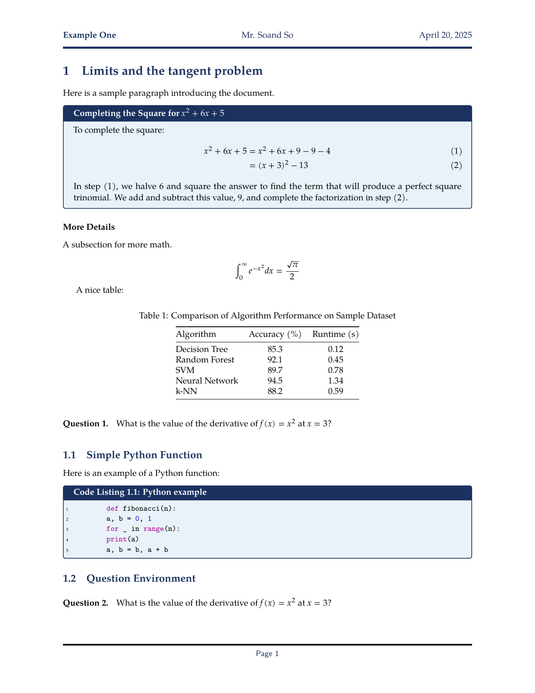

# README

This work is based on the style of the _eisvogel_ [pandoc latex template](https://github.com/Wandmalfarbe/pandoc-latex-template).

# Style and Requirements

Check out `kingfisher.sty`. This is a work in progress!

The **TeX Gyre Pagella** font is used in this project.
Remove references to it if you do not have it installed.

# Examples of usage

The following command requires `latexmk` and `entr`, but with these two utilities you should be
able to automatically compile your LaTeX document whenever you make changes to
it:

```{bash}
find . -name "*.tex" | entr -c sh -c 'latexmk -shell-escape -lualatex "$1" && latexmk -c -silent "$1"' sh /_
```

# Screenshot


